# Open Party Lab

Open Party Lab is a local-first browser party-game platform for shared screens and phone controllers. It is also an experiment in AI-assisted software development: the platform is structured so humans and coding agents can improve games, docs, tests, and tooling in small reviewable steps.

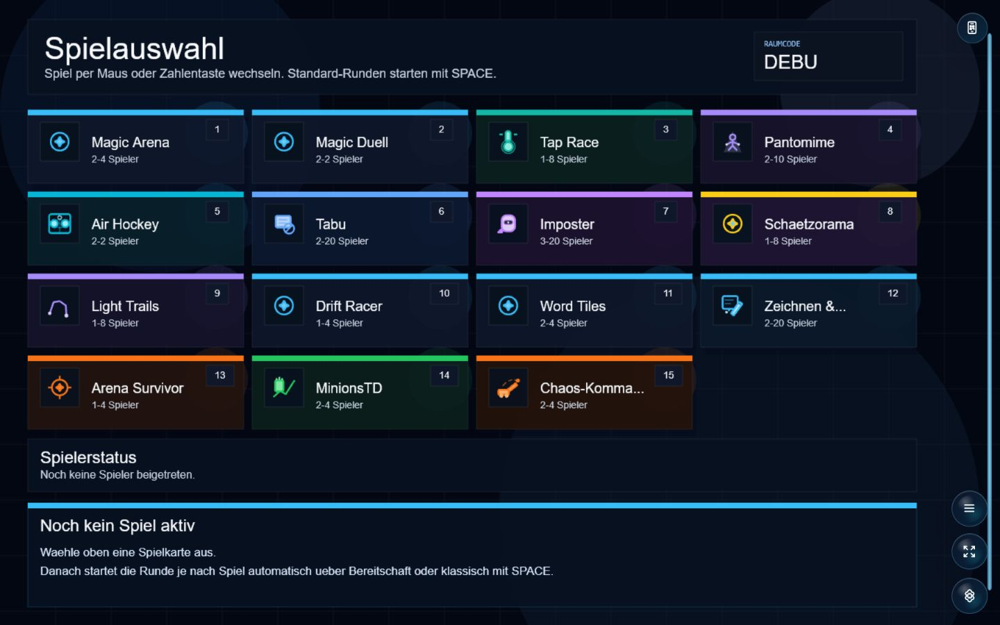

## Current Status

This is a playable local prototype, not a hosted production service. It is designed for devices on the same LAN.

Most games are still alpha or beta. The recommended set is already suitable for local sessions, but rules, pacing, scoring, content, UI, and balancing will continue to evolve.

## Game Showcase

### Arena Survivor — three complete visual themes

Arena Survivor is a cooperative survival run with character selection, escalating enemy waves, upgrades, and three synchronized host/controller art sets. The theme changes the complete presentation without changing game balance.

| Frostfire Saga | Obsidian Relay | Classic Arena |
| --- | --- | --- |
| 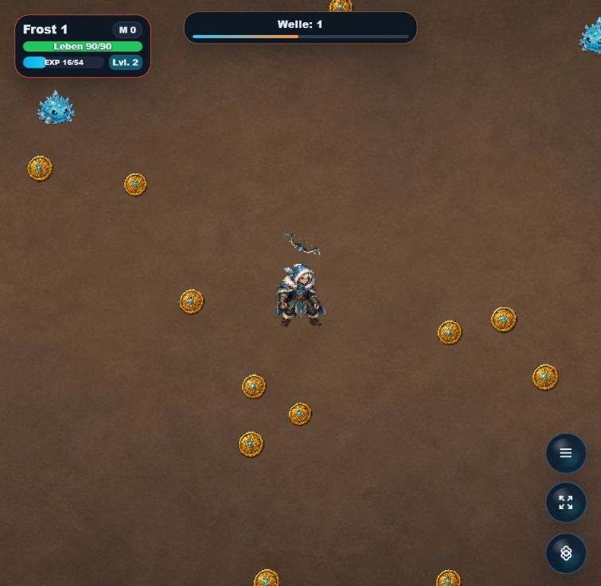 | 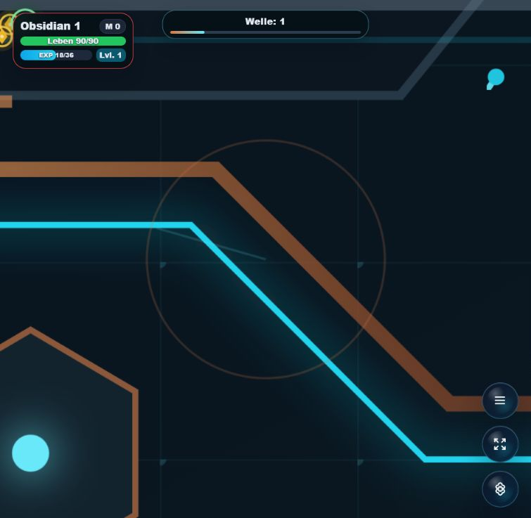 | 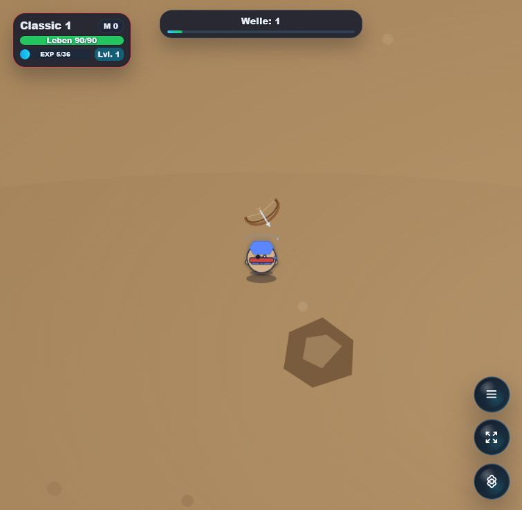 |

### All recommended games

Arena Survivor remains recommended alongside the complete existing set. The gallery below shows every other recommended game; none of the earlier recommendations were removed.

| Magic Arena | Magic Duell |
| --- | --- |
| 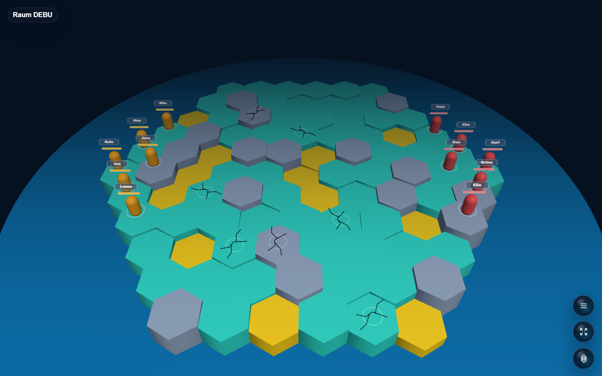 | 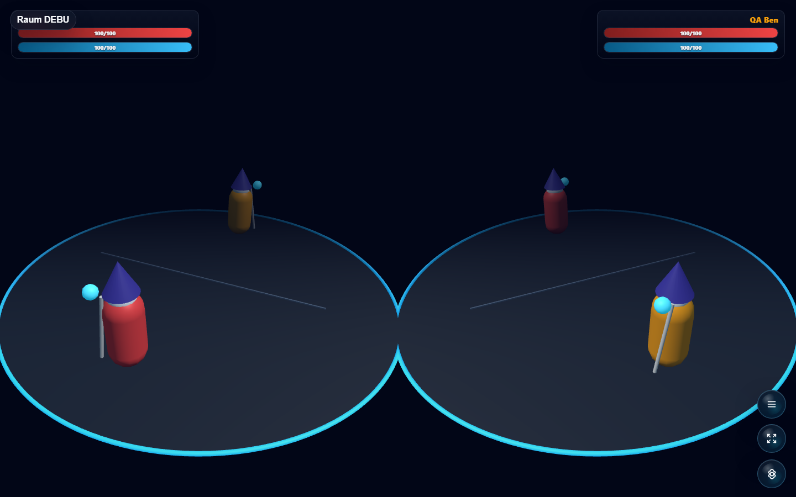 |
| **MinionsTD** | **Chaos-Kommando** |
| 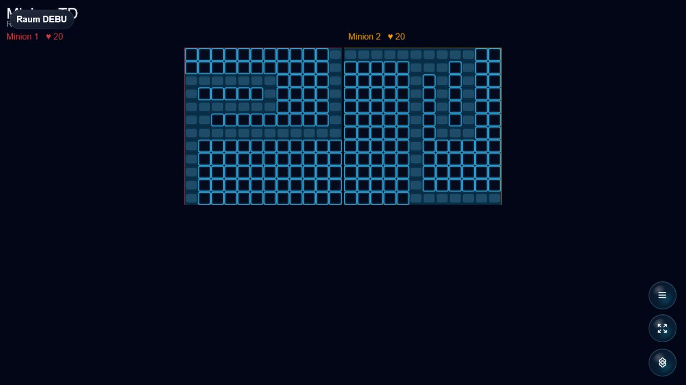 | 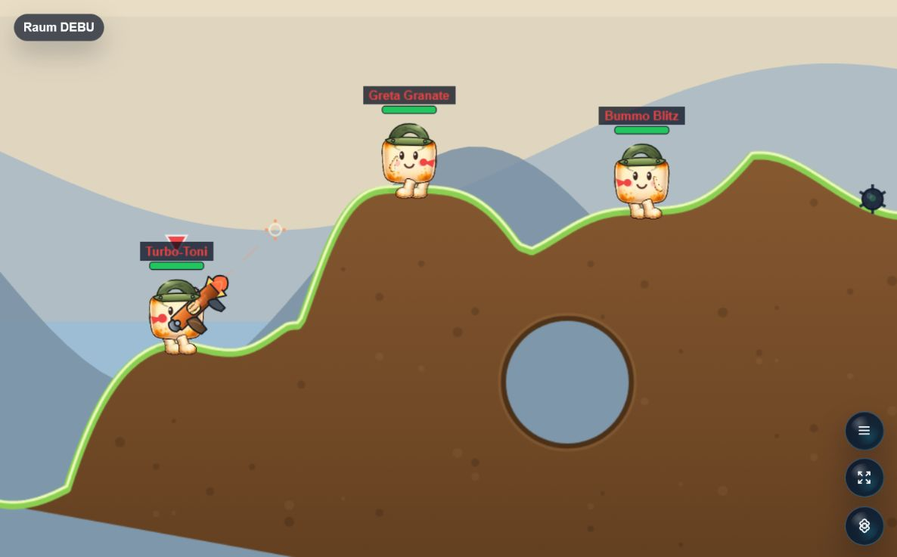 |
| **Zeichnen & Erraten** | **Schaetzorama** |
| 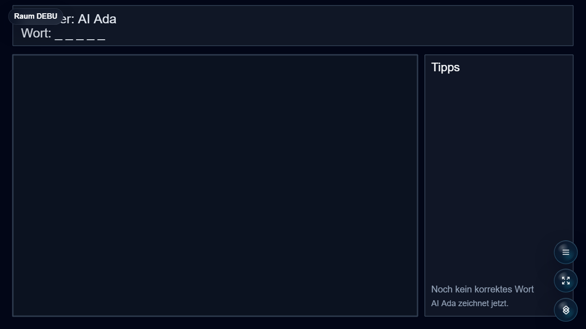 |  |
| **Word Tiles** | **Drift Racer** |
| 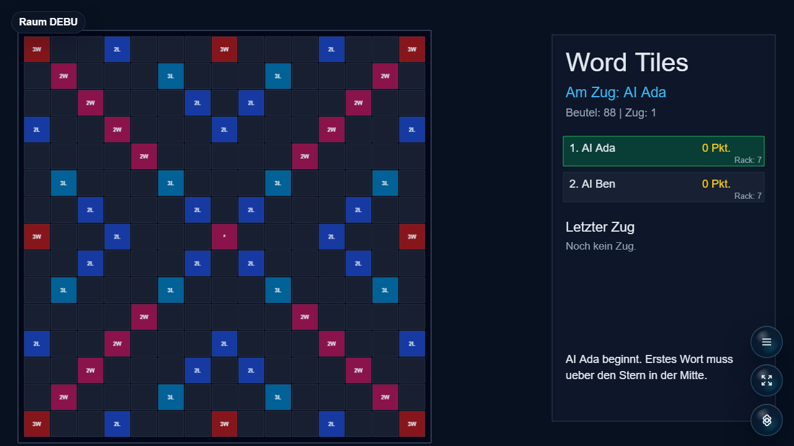 | 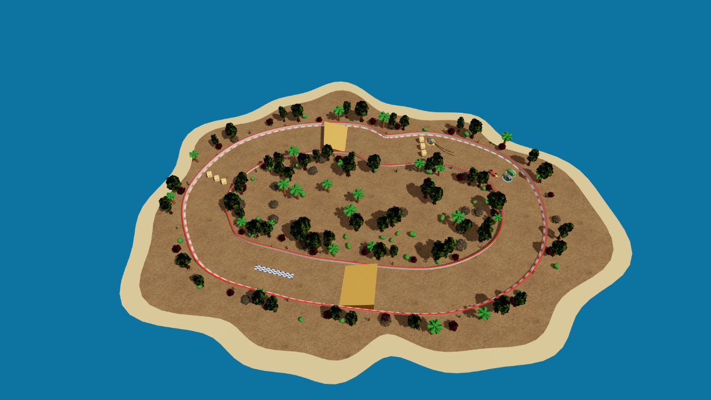 |

The recommended collection covers arena combat, duels, cooperative survival, tower defense, drawing, estimation, artillery, word play, and arcade racing. Every game uses the shared-screen host and phone-controller flow.

## How It Works

Open Party Lab runs three apps together:

- `apps/server`: authoritative Socket.IO room, round, score, and game-state server
- `apps/host`: Phaser host screen for a TV, monitor, projector, or shared computer
- `apps/controller`: React phone controller used by players in the browser

Shared platform code lives in workspace packages:

- `packages/protocol`: socket events, DTOs, and shared room/game-state contracts
- `packages/game-core`: game manifests, shared game types, round helpers, and layout keys
- `packages/ui-kit`: shared visual tokens
- `packages/utils`: small shared utilities

The platform supports optional multi-repo games. The core platform stays here; individual games can live in separate Git repos under `local-games/`. Missing optional games are normal and are skipped by the generator.

## Quick Start

### Download a portable Windows build

GitHub Releases provide `Open-Party-Lab-windows-x64.zip`. It contains the server, host, phone controller, every known game, and its own Node.js runtime:

1. Download and extract the complete ZIP.
2. Double-click `Open-Party-Lab.exe`.
3. The host opens in the default browser; players join from phones on the same LAN/Wi-Fi using the QR code.

No Node.js or npm installation is required for the portable build. Windows may show a SmartScreen warning because community builds are currently not code-signed. Port 3000 must be free, and Windows Firewall must allow private-network access.

### Run from source

Requirements:

- Node.js 20+
- npm 10+

From a fresh clone:

```bash
npm ci
npm run games:list
npm run build
```

Run locally on Windows:

```bash
npm run dev:all
```

Run locally on any platform with three terminals:

```bash
npm run dev:server
npm run dev:host
npm run dev:controller
```

Default local URLs:

- Server: `http://localhost:3000`
- Host: `http://localhost:5173`
- Controller: `http://localhost:5174`

For phone controllers, open the host through the computer's LAN address and make sure the QR code points to the same address, for example `http://192.168.0.156:5174`. On Windows, `npm run dev:all` tries to detect this automatically. If the QR code shows the wrong IP, restart the stack with an explicit LAN IP:

```powershell
powershell -ExecutionPolicy Bypass -File .\scripts\dev-all.ps1 -LanIp 192.168.0.156
```

If a dev port is already occupied, stop the running stack first:

```bash
npm run dev:stop
```

## Recommended Games

Clone the recommended game repos into `local-games/`:

```bash
npm run games:clone-recommended
npm run games:sync-local
```

Recommended optional local game repos:

| Game | Status | Local path |
| --- | --- | --- |
| Magic Arena | recommended alpha | `local-games/magic-arena` |
| Magic Duell | recommended alpha | `local-games/magic-duell` |
| Arena Survivor | beta, recommended | `local-games/arena-survivor` |
| MinionsTD | beta, recommended | `local-games/minions-td` |
| Zeichnen & Erraten | beta, recommended | `local-games/zeichnen-und-erraten` |
| Schaetzorama | beta, recommended | `local-games/schaetzorama` |
| Chaos-Kommando | alpha, recommended | `local-games/chaos-kommando` |
| Word Tiles | alpha, recommended | `local-games/word-tiles` |
| Drift Racer | alpha, recommended | `local-games/drift-racer` |

Other optional local game repos:

| Game | Notes | Local path |
| --- | --- | --- |
| Tap Race | playable prototype | `local-games/tap-race` |
| Pantomime | playable prototype | `local-games/pantomime` |
| Air Hockey | playable prototype | `local-games/air-hockey` |
| Tabu | playable prototype | `local-games/tabu` |
| Imposter | playable prototype | `local-games/imposter` |
| Light Trails | playable prototype | `local-games/light-trails` |

Manual clone example:

```bash
git clone https://github.com/Hartwich/magic-arena.git local-games/magic-arena
git clone https://github.com/Hartwich/magic-duell.git local-games/magic-duell
npm run games:sync-local
```

`games:sync-local` builds and links only the local game repos it finds. You do not need every game repo.

New game repos should use the short game name as the repo and folder name, for example `tap-race`, not an `open-party-game-` prefix. Package names can still use the scoped npm shape, for example `@open-party-lab/game-tap-race`.

## Useful Scripts

```bash
npm run games:list
npm run games:sync-local
npm run games:clear-local
npm run games:clone-recommended
npm run games:clone-all
npm run ai:controllers
npm run screenshots:readme
npm run dev:all
npm run dev:stop
npm run typecheck
npm run build
npm run release:windows
```

For AI browser checks, use virtual controllers instead of opening multiple phone browser windows:

```bash
npm run ai:controllers -- --room DEBU --players 4 --ready true --hold-ms 600000
```

To refresh README screenshots, start the server and host first, then run:

```bash
npm run screenshots:readme
```

The screenshot script captures the English host game-selection screen and builds a recommended-games collage from local game screenshots.

## LAN Setup

Phones must reach the server and controller app through the host machine's LAN IP.

Example PowerShell setup:

```powershell
$env:PUBLIC_CONTROLLER_ORIGIN="http://192.168.178.20:5174"
$env:VITE_SERVER_URL="http://192.168.178.20:3000"
```

Then start the platform with `npm run dev:all`, open the host app on the shared screen, and scan the QR code from each phone.

## Browser Notes

Use a Chromium-based browser or Safari for phone controllers when possible. Firefox can work, but controller sessions may sometimes have issues with fullscreen behavior, reconnect/session handling, or touch input timing.

The host screen is intended for a desktop browser. The controller is intended for phone-sized browser windows on the same network as the server.

## Contributing

Good contributions are usually small and vertical:

- playtest one game and open a focused report;
- improve controller text, layout, or feedback on phones;
- improve host-screen readability for a TV or monitor;
- propose balance, pacing, scoring, or rule-clarity improvements;
- add screenshots, docs, setup notes, or small smoke tests;
- build a new mini-game repo using the Mini-Game SDK.

When behavior changes, update the server logic, protocol types, host view, controller model, and docs together when needed.

Start with:

- [AGENTS.md](AGENTS.md)
- [CONTRIBUTING.md](CONTRIBUTING.md)
- [docs/agent-task-guide.md](docs/agent-task-guide.md)
- [docs/architecture.md](docs/architecture.md)
- [docs/minigame-sdk.md](docs/minigame-sdk.md)
- [docs/multi-repo-games.md](docs/multi-repo-games.md)
- [docs/create-a-game.md](docs/create-a-game.md)
- [docs/playtesting.md](docs/playtesting.md)
- [docs/project-status.md](docs/project-status.md)
- [docs/roadmap.md](docs/roadmap.md)

Recommended verification:

```bash
npm run games:list
npm run games:sync-local
npm run typecheck
npm run build
```

Keep generated output, logs, temporary browser profiles, and build artifacts out of source control. If a check cannot be run, state that clearly in the pull request.

Contributions are voluntary and unpaid. The maintainer may publish official builds, including a possible Steam release, to reach a larger player base. See [CONTRIBUTING.md](CONTRIBUTING.md) and [NOTICE.md](NOTICE.md).

## License

Code is licensed under the Apache License 2.0. See [LICENSE](LICENSE).

Assets, names, generated media, third-party references, and store distribution rights need separate care. See [NOTICE.md](NOTICE.md). This repository is not legal advice; get proper legal review before commercial distribution.
