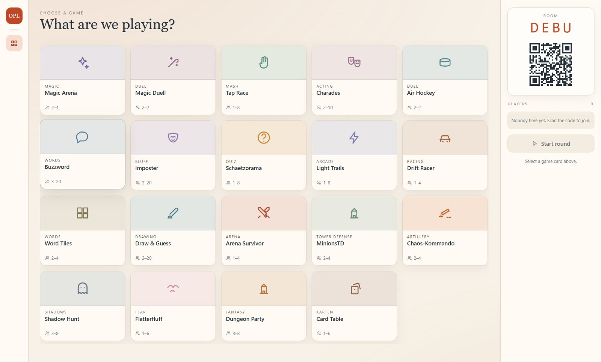
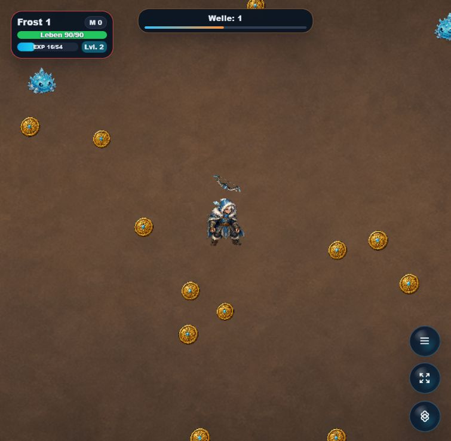
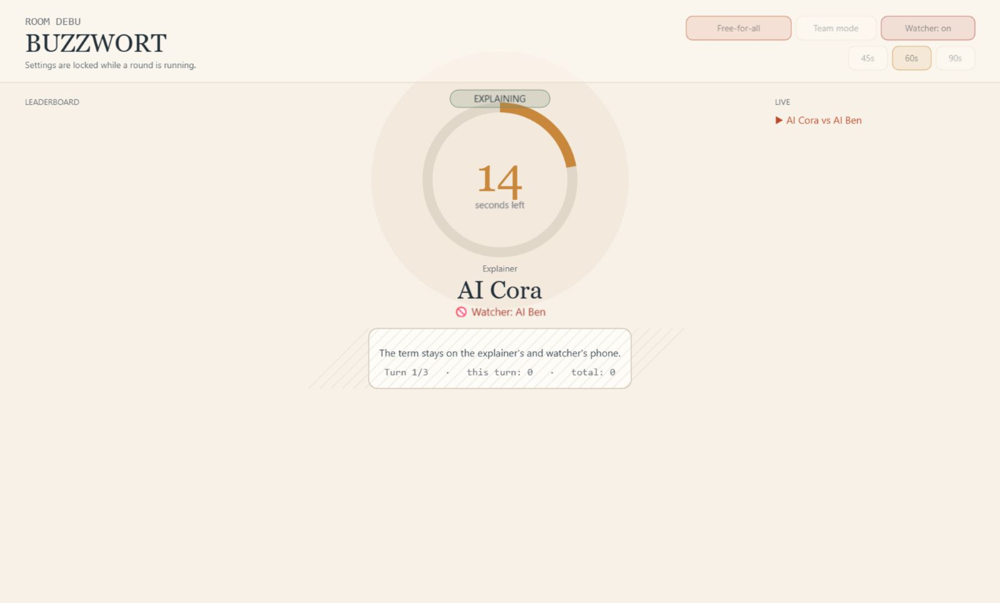
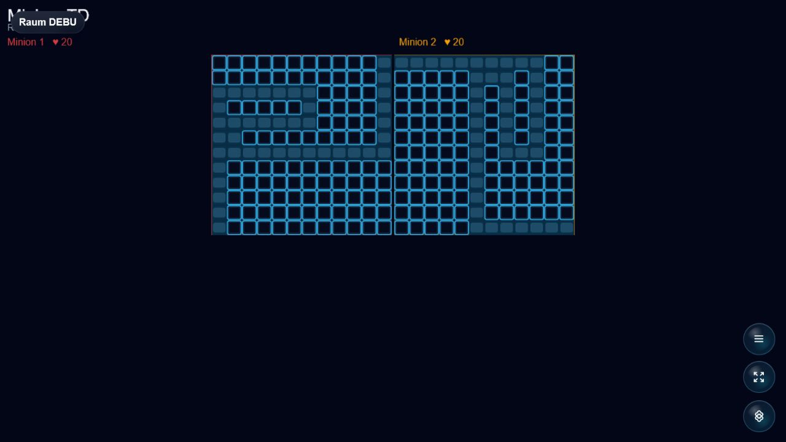
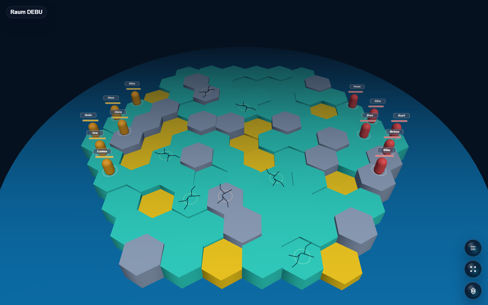
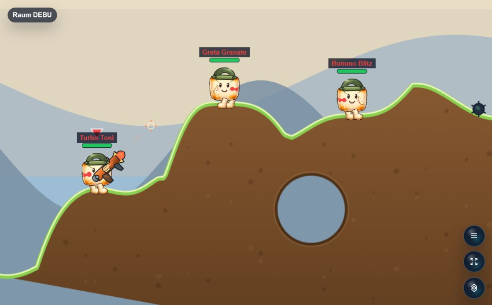
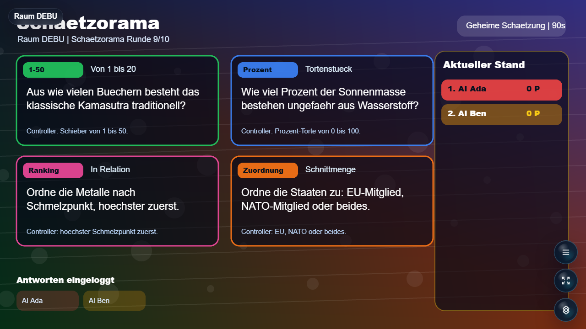
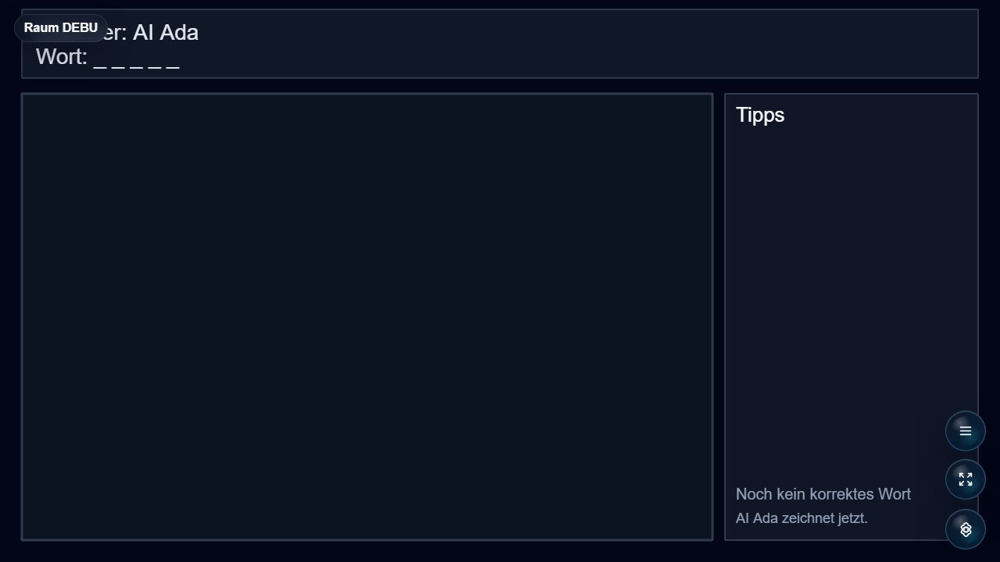
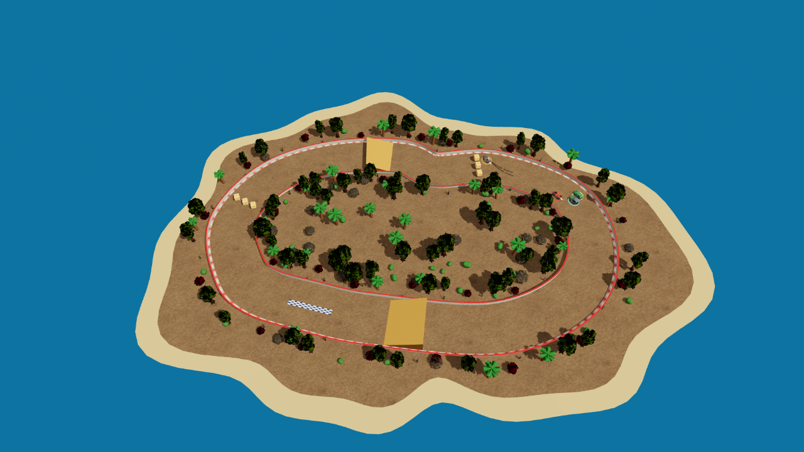

# Open Party Lab

[Try the public test server](https://open-party-lab.onrender.com) · [Download for Windows](https://github.com/Hartwich/Open-Party-Lab/releases) · [Report an issue](https://github.com/Hartwich/Open-Party-Lab/issues)

Open Party Lab is a browser-based party-game platform for a shared screen and players’ phones. Run it on your local network or use the hosted test server. The platform and its games are actively developed; most games are in alpha or beta.

The Render service is for testing, not production. It can take about a minute to wake after inactivity, and rooms are kept in memory rather than saved permanently.



## Games

The catalog includes 19 optional game projects. Twelve are currently recommended for playtesting; the rest are smaller prototypes, and Dungeon Party is an early development build. All are subject to change.

| Recommended games | Style |
| --- | --- |
| Arena Survivor | Cooperative arena survival |
| Buzzwort | Word guessing with forbidden words |
| Chaos-Kommando | Turn-based artillery |
| Drift Racer | Arcade racing |
| Flatterfluff | Comic-style gallery shooter |
| Kartentisch (Card Table) | Card games, including Doppelkopf, Rommé and Symboljagd |
| Magic Arena | Hex tactics |
| Magic Duell | Wizard duels with phone-drawn spells |
| MinionsTD | Competitive tower defense |
| Schaetzorama | Estimation quiz |
| Word Tiles | Shared word board |
| Zeichnen & Erraten | Drawing and guessing |

Other known games include Air Hockey, Imposter, Light Trails, Pantomime, Schattenjagd and Tap Race. Dungeon Party is in development. Optional games are separate repositories, so a fresh source checkout does not include their files until you clone them. The Windows release and hosted build assemble the known game repositories for you.

### A look at the games

These screenshots include the current host catalog and a live Buzzword round, alongside sample rounds from other games.

| Arena Survivor: Frostfire Saga | Buzzword host round | MinionsTD |
| --- | --- | --- |
|  |  |  |
| Magic Arena | Chaos-Kommando | Schaetzorama |
|  |  |  |
| Zeichnen & Erraten | Word Tiles | Drift Racer |
|  |  |  |

## Getting started

### Play online

Open the [public test server](https://open-party-lab.onrender.com), create a room, and scan its QR code with the phones joining the game. The free service may need around a minute to start after sitting idle. Rooms are temporary and may be lost when the service restarts.

### Use the Windows release

Download the latest `Open-Party-Lab-windows-x64.zip` from [GitHub Releases](https://github.com/Hartwich/Open-Party-Lab/releases), extract the complete archive, then start `Open-Party-Lab.exe`. The shared screen opens in a browser; players join from phones on the same Wi-Fi using the QR code. The release bundles Node.js and the games, so you do not need to install Node.js or npm. Windows may show a SmartScreen warning because community builds are not code-signed.

### Run from source

Requirements: Node.js 20+ and npm 10+.

```bash
npm ci
npm run games:clone-recommended
npm run build
npm run dev:all
```

`npm run dev:all` starts the local server, shared-screen host and controller. The default addresses are:

- Host: `http://localhost:5173`
- Controller: `http://localhost:5174`
- Server: `http://localhost:3000`

For phones to connect, they must use the computer’s LAN address, not `localhost`. On Windows, the launcher tries to find that address. If needed, set it explicitly:

```powershell
powershell -ExecutionPolicy Bypass -File .\scripts\dev-all.ps1 -LanIp 192.168.0.156
```

To stop the local stack, run `npm run dev:stop`.

## How the platform works

The server owns room state, game rules, timers, scoring and round transitions. The host renders the shared screen, while controllers send player input and show phone-sized UI.

- `apps/server` — authoritative Socket.IO server and room lifecycle
- `apps/host` — shared-screen app for a TV, monitor or computer
- `apps/controller` — browser controller for phones
- `packages/protocol` — shared socket and room contracts
- `packages/game-core` — game manifests, common types and layout keys
- `packages/ui-kit` and `packages/utils` — shared interface tokens and utilities

Games live in separate repositories under the ignored `local-games/` directory. `config/known-games.json` lists the repositories; `npm run games:sync-local` links the ones present on your machine and generates the local app registries. Missing optional repositories are skipped.

## Useful commands

```bash
npm run games:list          # Show known games and local links
npm run games:clone-all     # Clone all known game repositories
npm run games:sync-local    # Refresh local game links and registries
npm run games:clear-local   # Remove generated local links
npm run dev:all             # Start the local development stack on Windows
npm run dev:stop            # Stop the local development stack
npm run typecheck           # Type-check the platform and linked games
npm run build               # Build the platform and linked games
npm run release:windows     # Assemble a portable Windows release
```

To refresh the recommended-game collage, start the host first, then run:

```bash
npm run screenshots:readme -- --collage-only
```

The screenshot command uses Chromium or Edge through the Chrome DevTools Protocol and includes screenshots from recommended game repositories when available. The host-selection and live-round images above are captured from the running host.

For AI browser checks, add virtual players to an existing room:

```bash
npm run ai:controllers -- --room DEBU --players 4 --ready true --hold-ms 600000
```

## Contributing

Small, focused contributions are welcome: playtest a game, improve phone controls or host readability, clarify rules, or build a new mini-game. The server must remain authoritative, and user-facing text should follow the project’s localization patterns.

Start with [AGENTS.md](AGENTS.md), [CONTRIBUTING.md](CONTRIBUTING.md), [the architecture guide](docs/architecture.md), [the mini-game SDK](docs/minigame-sdk.md), [the multi-repo game guide](docs/multi-repo-games.md), and [playtesting notes](docs/playtesting.md). See [project status](docs/project-status.md) for current limitations and [Render deployment](docs/render-deployment.md) for hosting details.

## License

Code is licensed under the Apache License 2.0; see [LICENSE](LICENSE). Assets, names, generated media and third-party references have separate rights considerations; see [NOTICE.md](NOTICE.md).
